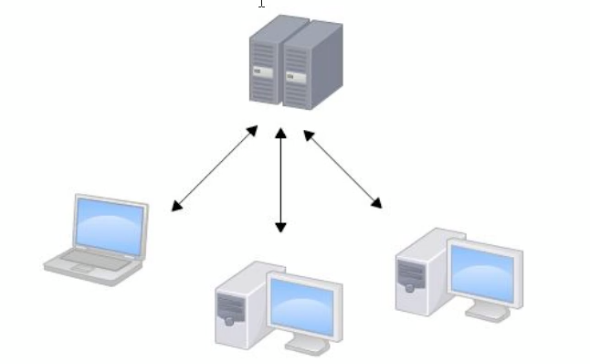
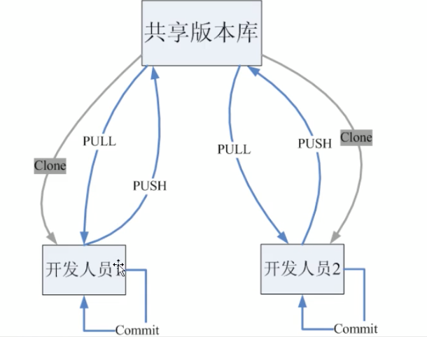
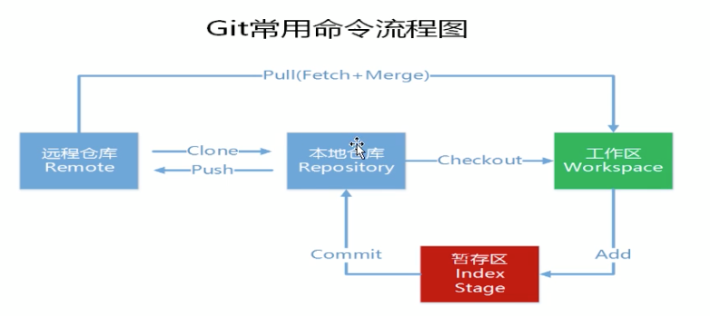

## 一、Git 和 SVN 

### 1.1、SVN

​		SVN是集中式版本控制系统，版本库是集中放在中央服务器的，而干活的时候，用的都是自己的电脑，所以首先要从中央服务器那里得到最新的版本，然后干活，干完后，需要把自己做完的活推送到中央服务器。集中式版本控制系统是必须联网才能工作，如果在局域网还可以，带宽大，速度够快，如果是在互联网下，如果网速慢的话就很郁闷了



​	集中管理方式在一定程度上看到其他开发人员在干什么，而管理员也可以很轻松掌握每个人的开发权限

​	但是相较于其优点而言，集中式版本控制工具缺点很明显：

	- 服务器单点故障
	- 容错性差


### 1.2、Git

​		Git是分布式版本控制系统，它没有中央服务器，每个人的电脑就是一个完整的版本库，这样，工作的时候就不需要联网了，因为版本都是在自己电脑上。既然每个人的电脑都有一个完整的版本库，那多个人如何协作呢？比如说自己在电脑上改了文件A，其他人也在电脑上改了文件A，这时，你们俩之间只需把各自的修改推送给对方，就可以互相看到对方的修改了。




## 二、git工作流程




## 三、使用git管理文件版本

### 3.1、创建版本库

```javascript
git init
```

### 3.2、添加文件

#### 3.2.1 添加文件过程

